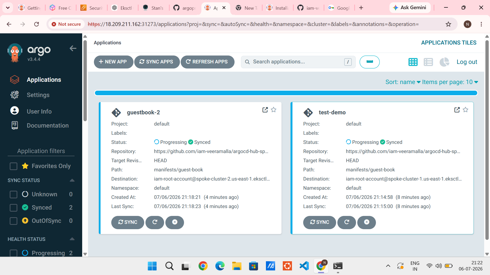

# 🚀 Multi-Cluster GitOps Deployment using Argo CD (Hub & Spoke Architecture)

## 📖 Project Overview

This project demonstrates a Multi-Cluster GitOps architecture using Argo CD. A central Hub Cluster manages application deployments across multiple Kubernetes Spoke Clusters through a single Argo CD control plane.

The setup enables centralized application management, automated synchronization, and GitOps-based deployments across multiple Kubernetes environments.

---

## 🏗️ Architecture

```text
                    GitHub Repository
                            │
                            ▼
                    Argo CD (Hub Cluster)
                            │
            ┌───────────────┴───────────────┐
            │                               │
            ▼                               ▼
      Spoke Cluster 1                Spoke Cluster 2
      (Application A)                (Application B)
            │                               │
            ▼                               ▼
     Kubernetes Pods                 Kubernetes Pods
```

---

## ⚙️ Technologies Used

- Kubernetes
- Argo CD
- GitOps
- Minikube
- Kubectl
- Git & GitHub
- Linux

---

## 🚀 Implementation Steps

### 1. Created Multiple Kubernetes Clusters

- Hub Cluster
- Spoke Cluster 1
- Spoke Cluster 2

### 2. Installed Argo CD on Hub Cluster

```bash
kubectl create namespace argocd

kubectl apply -n argocd \
-f https://raw.githubusercontent.com/argoproj/argo-cd/stable/manifests/install.yaml
```

### 3. Registered Spoke Clusters

```bash
argocd cluster add spoke-cluster-1

argocd cluster add spoke-cluster-2
```

### 4. Created Argo CD Applications

Configured Argo CD Applications to deploy workloads from GitHub repositories to both spoke clusters.

### 5. Enabled Automatic Synchronization

Argo CD continuously monitored the Git repository and automatically synchronized application changes to the target clusters.

---

## 📸 Argo CD Dashboard

The screenshot below shows the successful registration of multiple Kubernetes clusters and synchronized application deployment using Argo CD.



---

## ✅ Project Outcome

Successfully implemented a Hub & Spoke GitOps architecture where:

- One Argo CD instance manages multiple Kubernetes clusters.
- Applications are deployed from a centralized Git repository.
- Automatic synchronization ensures cluster state matches Git state.
- Multi-cluster deployments can be managed from a single dashboard.

---

## 📚 Skills Demonstrated

- Argo CD
- GitOps
- Multi-Cluster Kubernetes Management
- Kubernetes Administration
- Git & GitHub
- Linux
- YAML Configuration
- Continuous Deployment

---

## 🔍 Challenges Faced

- Configuring communication between Hub and Spoke clusters
- Registering external Kubernetes clusters in Argo CD
- Troubleshooting cluster authentication issues
- Managing application synchronization across clusters
- Understanding GitOps deployment workflows

---

## 🎯 Resume Summary

Implemented a Multi-Cluster GitOps solution using Argo CD Hub & Spoke architecture, enabling centralized deployment and management of applications across multiple Kubernetes clusters with automated synchronization and continuous delivery.
